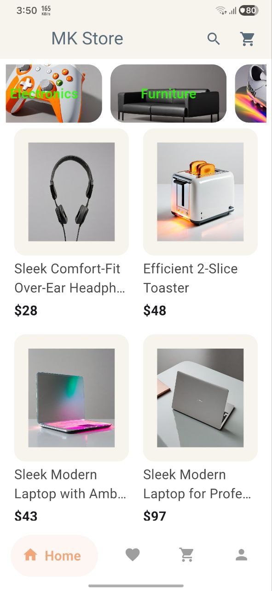
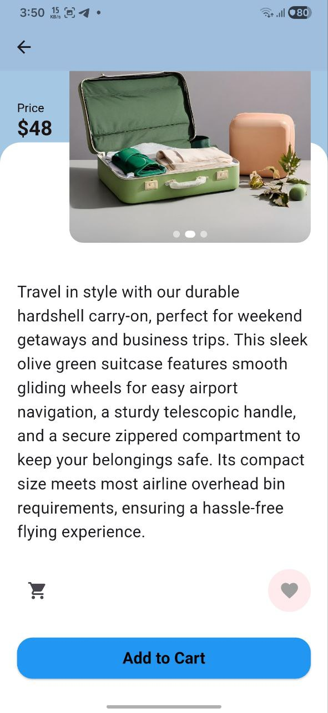
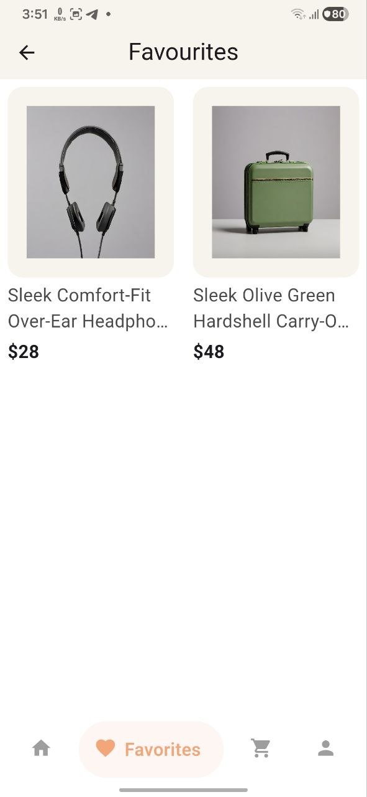
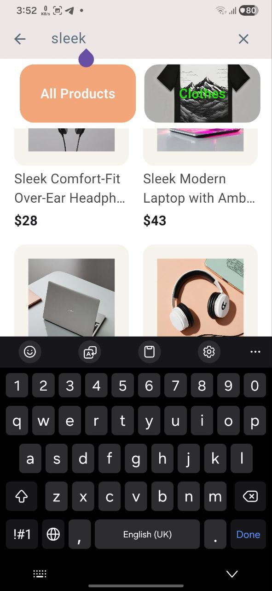
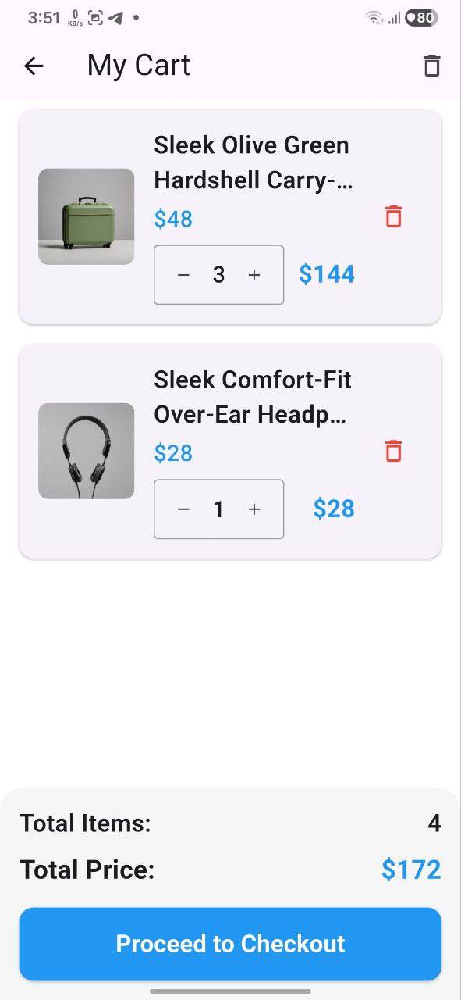

# MK Store 🛍️

[](https://flutter.dev) [](https://dart.dev) [](https://firebase.google.com) 

A full-featured **e-commerce mobile application** built with Flutter. Browse products, manage cart, and shop seamlessly with Firebase authentication and real-time data.

---

## ✨ Features

- 🛍️ **Product Catalog** - Browse 100+ products across multiple categories
- 🔐 **Authentication** - Email/Password & Google Sign-In via Firebase
- ❤️ **Favorites** - Save products for later with persistent storage
- 🛒 **Smart Cart** - Add, remove, update quantities with real-time totals
- ⚡ **Fast Performance** - Lazy loading, caching, and optimized API calls (60% less code)
- 🔍 **Search & Filter** - Find products by category or search term

---

## 📸 Screenshots

<p align="center">
  
 
 
 
 
 
 
 

</p>

*Onboarding | Home | Product Details | Cart*

---

## 🛠️ Tech Stack

**Core:**
- Flutter & Dart (^3.7.2)
- BLoC/Cubit - State management
- GetIt - Dependency injection
- Firebase (Auth, Firestore)

**Networking:**
- Retrofit (^4.9.0) - Type-safe REST client
- Dio (^5.9.0) - HTTP requests
- JSON Serialization - Auto-generated models

**Storage:**
- SharedPreferences - Local preferences
- Firestore - Cloud database
- Secure Storage - Sensitive data

**UI/UX:**
- ScreenUtil - Responsive design
- Cached Network Images
- Shimmer loading effects
- Material Design 3


---

## 🏗️ Architecture

Clean Architecture with feature-first organization:

```
lib/
├── core/
│   ├── di/              # Dependency injection (GetIt)
│   ├── routing/         # App navigation
│   ├── services/        # Firebase, API services
│   └── helpers/         # Utilities
├── features/
│   ├── home/
│   │   ├── data/        # API, models, repos
│   │   ├── logic/       # ProductsCubit
│   │   └── ui/          # Views, widgets
│   ├── cart/            # Cart management
│   ├── login/           # Authentication
│   └── sign_up/         # Registration
└── main.dart
```

**Pattern:** Repository + Cubit + Dependency Injection


---


## 🤝 Contributing

1. Fork the repo
2. Create feature branch (`git checkout -b feature/amazing`)
3. Commit changes (`git commit -m 'Add feature'`)
4. Push to branch (`git push origin feature/amazing`)
5. Open Pull Request

Run `flutter analyze` before submitting.

---


## 📧 Contact

**Mohamed Ibrahim Almaken**  
Junior Flutter Developer

📧 [m7mdmaken@gmail.com](mailto:m7mdmaken@gmail.com)  
💼 [LinkedIn](https://linkedin.com/in/m7mdmaken)  
🐙 [GitHub](https://github.com/m7mdmaken)  
📱 +201096587177

---

<p align="center">Built with ❤️ using Flutter & Firebase</p>
